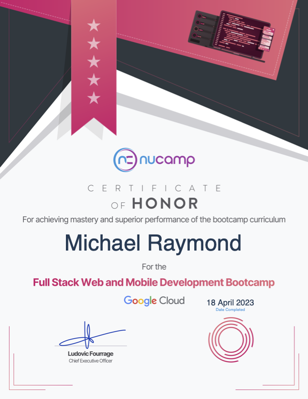

# Nucamp Full Stack Web + Mobile Development

Section 1: Front-End, HTML/CSS/JavaScript

[Section 2: Front-End Web UI Framework, Bootstrap](./NucampFolder/2-Bootstrap)

[Section 3: Front End JavaScript Library, React](./NucampFolder/3-React/)

Steps to init/deploy in Firebase:

```
firebase init
Hosting: Configure files for Firebase Hosting
Use an existing project
public dir? build
single-page app? y
firebase deploy
```

[Section 4: Multiplatform Mobile App Development with React Native](./NucampFolder/4-React-Native/)

[Section 5: Server-side Development with NodeJS, Express and MongoDB](./NucampFolder/5-NodeJS-Express-MongoDB/)

To deploy/redeploy nucampServer gcloud function:

```bash
cd Nucamp-Fullstack-Course/deploy/nucampsiteServerGCP
gcloud functions deploy nucampsiteServer --trigger-http --runtime nodejs12 --allow-unauthenticated
```

Deployed MERN Stack website: [NuCamp Camping Site](https://nucampsite-client-michaelr.web.app)

Honors project: [Barkbook](https://github.com/mjr2595/borker) 🐾


